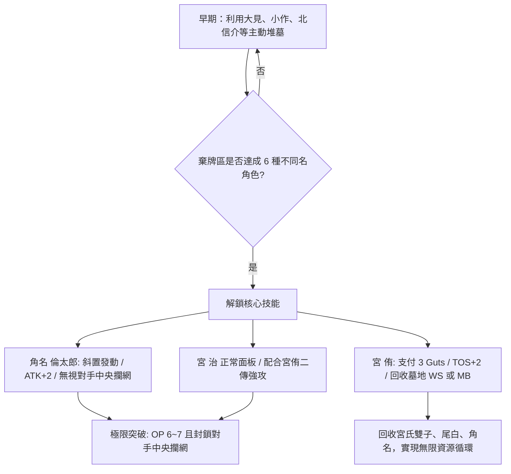

# 稻荷崎「堆墓角名」牌組 策略分析報告

> [Gemini 2026-06-19] 本報告基於「稻荷崎 堆墓角名」真實牌組（40張，無雙子速攻，僅3張「どや」事件卡）進行戰術推演與環境分析，結合最新官方規則判例。

---

## 1. 牌組核心機制解析

稻荷崎「堆墓角名」是一副極具中後期滾雪球與資源循環能力的「強攻型控制」牌組。其核心勝利引擎圍繞**「棄牌區（Drop Area）中合計有 6 種或以上不同卡名的稻荷崎角色卡」**展開。一旦達成此一門檻，牌組的多個核心角色將解鎖質變級的強力效果，撕裂對手的防守防線。

### 稻荷崎 堆墓角名 牌組列表 (40張)
*   **宮 侑 (HV-P02-017) x4** — S2/BLK0/RCV0/TOS1/ATK2；舉球：支付3Guts，TOS+2，若棄牌區有6種或以上不同卡名的稻荷崎，從棄牌區將最多1張WS或MB加入手牌。
*   **宮 侑 (HV-P02-018) x1** — S2/BLK0/RCV0/TOS1/ATK2；無技能。
*   **宮 治 (HV-P02-022) x2** — S1/BLK0/RCV5/TOS0/ATK3；無技能。
*   **宮 治 (HV-D03-005) x2** — S1/BLK0/RCV5/TOS0/ATK2；無技能。
*   **宮 治 (HV-P02-021) x1** — S1/BLK0/RCV5/TOS0/ATK2；無技能。
*   **角名 倫太郎 (HV-D03-007) x1** — S1/BLK1/RCV3/TOS0/ATK3；無技能。
*   **角名 倫太郎 (HV-P02-027) x1** — S1/BLK2/RCV1/TOS0/ATK2；攻擊：若棄牌區有6種或以上不同卡名的稻荷崎，可斜放此卡發動，此角色ATK+2，下個對手回合中，對手選擇攔網時無視對手中央攔網角色的BLK值。
*   **北 信介 (HV-P02-024) x3** — S1/BLK0/RCV5/TOS0/ATK0；接球：棄1張手牌，並支付3Guts發動，此角色RCV+1，且可從己方事件區將最多1張稻荷崎卡牌加入手牌。
*   **北 信介 (HV-D03-006) x1** — S1/BLK0/RCV5/TOS0/ATK0；無技能。
*   **銀島 結 (HV-P02-032) x1** — S1/BLK0/RCV0/TOS0/ATK3；無技能。
*   **銀島 結 (HV-D03-009) x2** — S1/BLK0/RCV0/TOS0/ATK3；無技能。
*   **赤木 路成 (HV-P02-034) x4** — S1/BLK0/RCV6/TOS0/ATK0；無技能。
*   **赤木 路成 (HV-D03-011) x1** — S1/BLK0/RCV5/TOS0/ATK0；無技能。
*   **尾白 阿蘭 (HV-P02-029) x3** — S1/BLK0/RCV3/TOS0/ATK3；無技能。
*   **宮兄弟 (HV-P02-077) x3** — S/WS；登場時可將此角色卡名更改為「宮 侑」或「宮 治」。
*   **大耳 練 (HV-P02-033) x1** — S1/BLK3/RCV2/TOS0/ATK2；無技能。
*   **小作 裕渡 (HV-P02-035) x3** — S3/BLK0/RCV0/TOS0/ATK2；發球/接球：在己方接球階段，可將手牌的此卡丟棄至棄牌區發動，己方1名稻荷崎角色RCV+2。
*   **大見 太郎 (HV-P02-085) x3** — S1/BLK0/RCV0/TOS0/ATK2；接球：此角色登場或在接球區時，己方1名稻荷崎角色的接球值+1，可棄1張手牌發動，抽2張牌。
*   **どや俺の仲間すごいやろって もっと言いたかったわ (HV-P02-089) x3** — EVENT/抽牌；在己方主要階段發動，抽1張牌，從己方棄牌區將最多1張宮侑、最多1張宮治、最多1張宮兄弟加入手牌，加入3張時棄1張手牌。
合計：40張（事件卡：3張，符合限制）



### 1.1 六種主動與被動堆墓路徑

為了以最快速度解鎖「墓地 6 種不同名角色」，本牌組配備了 6 種不同的堆墓與過牌途徑，確保在 Set 2 結束前穩定達成條件：

1.  **大見 太郎 (HV-P02-085) —— 主動抽濾堆墓**：
    *   **效果**：接球階段發動，使己方 1 名稻荷崎角色接球值 +1。丟棄 1 張稻荷崎手牌發動，抽 2 張卡。
    *   **戰術作用**：最核心的主動堆墓與過牌手段。能精準將手上暫時無用或重複的角色卡送入棄牌區，同時抽取 2 張，優化手牌質量。
2.  **北 信介 (HV-P02-024) —— 手牌戰術置換**：
    *   **效果**：登場於接球區。棄 1 張手牌，並支付 3 Guts 發動，使自身接球值 +1（達 RCV 6），並從事件區回收最多 1 張稻荷崎卡牌（即「どや」事件卡）至手牌。
    *   **戰術作用**：在防守的同時，通過「棄 1 張手牌」將特定角色送墓，並能回收已使用過的強力事件卡「どや」，兼具防守、堆墓與事件回收三重效益。
3.  **小作 裕渡 (HV-P02-035) —— 手牌即時自棄防守**：
    *   **效果**：接球階段，直接從手牌中丟棄此卡發動，使己方 1 名稻荷崎角色接球值 +2。
    *   **戰術作用**：**不佔用出場次數**的即時防守 Buff。此卡從手牌直接「自棄入墓」，在關鍵時刻拉高接球值化解危機，同時無痛增加墓地角色種類。
4.  **「どや俺の仲間すごいやろって」 (HV-P02-089) —— 雙子回收溢出捨棄**：
    *   **效果**：抽濾事件卡。從棄牌區將最多 1 張「宮 侑」、最多 1 張「宮 治」、最多 1 張「宮兄弟」加入手牌。若回收 3 張，則必須從手牌棄 1 張卡至棄牌區。
    *   **戰術作用**：後期的終極回收引擎。在回收雙子三人組時，強制丟棄 1 張手牌，可用於精準堆墓其他稻荷崎角色，維持墓地多樣性。
5.  **Guts 消耗與轉化堆墓（核心資源轉換）**：
    *   **機制**：當己方角色發動需要支付 Guts 的技能時（如宮侑 3 Guts、北信介 3 Guts 等），被用作 Guts 支付的角色卡會從 Guts 區送入棄牌區。
    *   **戰術作用**：這需要玩家精細管理 Guts 區的角色卡名。在前期將不同的角色卡作為 Guts 放置，在中期發動技能消耗 Guts 時，這些不同的卡牌會一併落入棄牌區，瞬間達成 6 種門檻。
6.  **登場覆蓋與失分結算落墓**：
    *   **機制**：當新角色登場覆蓋在已有角色之上，或回合結束、失分（Lost）結算時，場上的角色會轉化為 Guts 或直接送入棄牌區。

### 1.2 「雙子爆發」與靈活改名機制

*   **宮兄弟 (HV-P02-077) 的變身彈性**：登場時可改名為「宮 侑」或「宮 治」。這極大地降低了雙子連鎖卡手的機率。
*   **宮 侑 (HV-P02-017)**：在堆墓 6 種解鎖後，二傳值達 **TOS 3**（基礎 1 + 2），並能支付 3 Guts 從墓地回收 1 張 WS 或 MB 角色卡。
*   **宮 治 (HV-P02-022) / (HV-D03-005)**：宮治提供強大的進攻打擊面。
*   **雙子強攻連鎖**：以宮侑 TOS3 二傳，配合場上宮治（如 P02-022 基礎 ATK3），無任何事件卡輔助下即可直接輸出穩定且高額的 **OP 6** 進攻，若有大見太郎或小作支援，威力更盛。

### 1.3 角名 倫太郎 (HV-P02-027) 的無視中央攔網

角名是針對防守型/攔網型牌組的終極解法。
*   當墓地達成 6 種時，在攻擊區**「將此卡斜置（橫置）作為代價」**，使其自身 **ATK+2（達 ATK 4）**，且下個對手回合中，**無視對手中間攔網角色（Center Blocker）的 Block Point（視為無/0）**。
*   這使得對手的中攔防線瞬間癱瘓，對手只能依靠左右兩側的側攔（Side Blockers）計算總 DP，極易導致攔網失敗。

### 1.4 北 信介 (HV-P02-024) 回收與手牌管理

北信介是牌組後期的穩定錨。
*   登場於接球區，通過「丟手牌 1 張 + 支付 3 Guts」，接球值 +1（達 RCV 6），並從事件區回收最多 1 張稻荷崎卡牌。
*   **手牌與 Guts 管理**：由於北信介與宮侑的技能消耗極高（需丟手牌及支付 3 Guts），玩家必須精準算牌。大見太郎的「丟1抽2」與「どや」的「回收3丟1」是用於調節手牌數量的關鍵。不能盲目使用回收，必須保留足夠的角色作為 Guts 來源，否則會出現手牌溢出但 Guts 不足，或是有 Guts 卻無手牌發動回收的尷尬局面。

---

## 2. 遊戲計劃（Game Plan）

### 2.1 早期（Set 1-2）：堆墓與資源積累

*   **核心目標**：快速堆墓至 6 種不同名，並積累 Guts。
*   **戰術部署**：
    1.  首回合二傳與攻擊手正常登場，不強求高 OP。若手牌有大見 太郎 (P02-085)，在接球階段立即發動「丟1抽2」，將重複的或低優先級角色送墓。
    2.  若防守吃緊，主動從手牌丟棄 小作 裕渡 (P02-035) 提供 RCV+2，不消耗出場權的同時增加墓地種類。
    3.  將不同的角色（如赤木、尾白、小作、宮兄弟等不同卡名）送入 Guts 區，為中期的 Guts 消耗堆墓做準備。
    4.  首盤可以允許少量失分，重點在於完成墓地與手牌的優化。

### 2.2 中期（Set 3-4）：門檻解鎖與雙子/角名爆發

*   **核心目標**：發動不可防守的強攻，奪回 Set 主導權。
*   **戰術部署**：
    1.  確認墓地已達成 6 種不同名角色卡。
    2.  **雙子強攻線**：登場宮侑 (P02-017) 於二傳位，發動技能（支付 3 Guts），二傳值達 TOS 3，並回收墓地的角名。配合宮治 (P02-022) 登場於攻擊位，輸出穩定 **OP = 3 (TOS) + 3 (ATK) = 6**。
    3.  **角名突破線**：面對強攔網牌組時，以角名倫太郎 (P02-027) 作為攻擊手。發動斜置技能，ATK 達 4。配合宮侑 TOS 3，總 OP 達 7，且無視對手中攔，輕鬆突破對手攔網。
    4.  防守端以 赤木 路成 (P02-034, RCV 6) 站穩接球位。

### 2.3 後期（決勝盤）：北信介與「どや」循環

*   **核心目標**：以無限資源鏈徹底擊垮對手的 Set 區。
*   **戰術部署**：
    1.  利用事件卡「どや俺の仲間」從墓地一次性回收「宮侑 + 宮治 + 宮兄弟」，重組進攻陣線。
    2.  防守時，登場 北 信介 (P02-024) 於接球區，棄 1 手牌並支付 3 Guts，使其 RCV 達 6，並**回收事件區的「どや俺の仲間」**。
    3.  下個回合，再度使用「どや」回收雙子進行進攻，形成雙子強打。
    4.  此時墓地與手牌、事件區已形成閉環循環，稻荷崎可以每回合穩定輸出高 OP，直到對手 Set 區歸零。

---

## 3. 關鍵組合與連鎖

### 組合 A：角名無視防線扣殺（強攔網毀滅者）

```
條件：墓地稻荷崎角色卡 ≥ 6 種
配置：二傳位 宮 侑 (P02-017, TOS 3) + 攻擊位 角名 倫太郎 (P02-027)
發動：角名登場於攻擊區，將其「斜置」發動技能。
效果：角名自身 ATK+2 (達 ATK 4)，下個對手回合無視對手中攔的 BLK 點數（視為 0）。
結果：總 OP 達 7。對手中攔（如鎌先 BLK 8、天童）之防守值被廢除。
戰術用途：面對伊達工業或白鳥沢的銅牆鐵壁時，直接將其中央 DP 降至 0，迫使對手只能靠側攔硬接。
```

### 組合 B：「どや」雙子墓地大回收

```
事件卡：どや俺の仲間すごいやろって (HV-P02-089)
效果：抽 1，從棄牌區回收「宮侑」1張、「宮治」1張、「宮兄弟」1張。若回收3張，則棄1張手牌。
戰術用途：當前一輪進攻的角色（宮侑、宮治、宮兄弟）因為失分或回合交替落入墓地後，用此卡無痛全部回收。棄掉的 1 張手牌可以選擇其他角色卡以配合堆墓。
```

### 組合 C：北信介事件複寫連鎖

```
配置：登場接球位 北 信介 (P02-024)
代價：棄手牌 1 張 + 支付 3 Guts
效果：北信介 RCV 達 6，從己方事件區回收最多 1 張「どや」事件卡。
戰術用途：將上一輪已進入事件區的回收卡拿回手中，確保下回合能再次發動雙子大回收，保持不間斷的王牌戰力輸出。
```

---

## 4. 起手最佳化（Opening Hand Strategy）

本牌組極度依賴早期的過牌與堆墓，因此起手需要兼顧「過牌件」與「雙子/北信介等核心組件」。

### 4.1 最理想起手（6張）

| 卡名 | 數量 | 戰術作用 |
|---|---|---|
| **大見 太郎 (HV-P02-085)** | 1 | 核心過牌與主動丟牌堆墓。 |
| **小作 裕渡 (HV-P02-035)** | 1 | 提供即時手牌防守（RCV+2）並無痛落墓。 |
| **宮兄弟 (HV-P02-077)** | 1 | 萬用進攻/二傳件，可隨時變身補位。 |
| **宮 侑 (HV-P02-017)** | 1 | 解鎖後 TOS 3 的主力二傳手。 |
| **北 信介 (HV-P02-024)** | 1 | 中後期防守與事件卡回收核心。 |
| **赤木 路成 (HV-P02-034)** | 1 | 基礎 RCV 6 的防守大閘。 |

*   **判定標準**：有大見太郎或小作裕渡保障早期堆墓；有雙子組件與防守大閘。

### 4.2 可接受起手

*   **無大見但有「どや」型**：利用宮侑、宮治正常登場，等待其落墓後再使用「どや」回收，手牌丟棄進行堆墓。
*   **防守過載型**：起手包含多張赤木、北信介，雖然前期攻擊力低，但防線極度穩固，可拖慢比賽節奏進行堆墓。

### 4.3 必須換牌的情況（Mulligan）

1.  **全為高耗能角色但無 Guts 來源**：手牌均為宮侑 (P02-017)、北信介，且無大見太郎或小作等低耗/丟牌件，容易導致前期卡死。
2.  **無任何「宮 侑/宮 治/宮兄弟」**：牌組缺乏核心進攻手段，即使完成堆墓也無法發動雙子強攻。
3.  **手牌全為高星角色且無接球手**：角色卡不足，無法建立場上面板，防線與攻擊線雙雙崩潰。

---

## 5. 優勢與劣勢分析

### 5.1 優勢（Strengths）

*   **✅ 恐怖的後期續航能力**：一旦墓地達成 6 種，墓地即變為第二手牌庫。宮侑回收角色、北信介回收事件、「どや」大回收雙子，資源近乎無限。
*   **✅ 防守型強攔網的絕對克星**：角名倫太郎的「無視中攔」直接讓對手精心佈置的中央 DP（如鎌先 BLK 8、天童）變為 0，令攔網牌組防線癱瘓。
*   **✅ 頂級的面板防守值**：赤木路成具有基礎 RCV 6，配合小作手牌支援可達 RCV 8，防守端極具彈性。

### 5.2 劣勢（Weaknesses）

*   **❌ 漫長的啟動空窗期**：在堆墓未滿 6 種前，宮侑僅有 TOS 1，宮治僅有 ATK 2/3，此時進攻 OP 較低，容易在 Set 1~2 被對手搶下分數。
*   **❌ 極高的 Guts 消耗**：宮侑技能需 3 Guts、北信介需 3 Guts。若 Guts 區規劃失誤或手牌管理不當，會導致空有回收技能卻付不起 Guts 的資源鏈斷裂。
*   **❌ 懼怕墓地干擾與手牌控制**：面對音駒等具備磨庫（如二口 PR 磨掉庫頂關鍵卡）或限制手牌（如及川手牌壓制）的牌組時，資源循環容易被強行干斷。

---

## 6. 對四大主流對局分析與數值對決

### 6.1 對「白鳥沢最強」對局

*   **對局評級**：**50% - 55% 均勢至微優**
*   **戰術焦點**：防守端如何接下牛島若利（常規 OP 8~9）的重扣；進攻端如何越過天童覺的「猜攔」。
*   **數值防線對決**：
    *   **白鳥沢進攻**：牛島 (P01-056, ATK 6) + 二傳 (TOS 2) = OP 8。
    *   **稻荷崎防禦配置**：
        1.  登場 赤木 路成 (P02-034, RCV 6)。
        2.  從手牌丟棄 小作 裕渡 (P02-035) 使赤木 RCV+2（達 RCV 8）。
        3.  若對手 OP 達 9，再配合 大見 太郎 (P02-085, RCV+1) 疊加至 **RCV 9**，強行接起牛島的扣殺。
    *   **稻荷崎反擊**：天童覺的攔網值通常較高，但稻荷崎一旦解鎖角名，角名倫太郎 (P02-027) 登場斜置，天童（中央攔網）的 BLK 點數直接歸零，白鳥沢僅能依靠側攔（BLK 1~2），總 DP 極難突破 4，稻荷崎雙子/角名進攻判定必過。

### 6.2 對「梟谷參賽」對局

*   **對局評級**：**55% - 60% 微優**
*   **戰術焦點**：以解鎖後的雙子高 OP 攻擊（OP6+）直接穿透梟谷防線。
*   **數值攻守對決**：
    *   **梟谷防禦**：梟谷防守能力一般，主要接球手（如木葉、小見）常規 RCV 為 5~6。
    *   **稻荷崎進攻配置**：
        1.  墓地 6 種解鎖。二傳位 宮侑 (P02-017) TOS3（發動技能消耗 3 Guts）+ 攻擊位 宮治 (P02-022) ATK 3 = **OP 6**。
        2.  梟谷只能以木葉 (BLK 2) + 鷲尾 (BLK 3) 攔網，DP 僅 5，攔網失敗。其接球手面對 OP 6 的扣殺，RCV 5~6 面臨平點或破防點。
        3.  若有大見太郎或小作等支援，OP 進一步提升，能穩定打破梟谷的防守底線。

### 6.3 對「音駒二口干擾（磨庫軸）」對局

*   **對局評級**：**45% - 50% 均勢至微劣**
*   **戰術焦點**：提防二口 堅治 (HV-PR-027) 的磨庫效果，精確判定「非抽牌加入手牌」的範疇。
*   **二口 PR-027 效果與「進牌」勘誤釐清**：
    *   二口 PR-027 效果只針對**「引く（抽牌）以外的方法」將卡牌加入手牌**。
    *   **抽牌（mode = draw）不會觸發二口**：包含抽牌階段的抽牌、選擇接球後的抽牌、以及**效果為「卡片1枚引く（抽1張牌）」**（例如打出「どや俺の仲間」時先執行的抽1張牌動作，以及及川「俺も思った☆」的抽1張牌效果）。
    *   **加入手牌（mode = effect）會觸發二口**：只有當對手使用寫有「手札に加える（加入手牌）」的技能時，包含：從墓地回收（宮侑 P02-017 技能、どや事件卡回收雙子）、從事件區回收（北信介 P02-024 技能）、從卡組檢索（赤葦京治技能）等，才會觸發二口磨牌庫頂3張的效果。
    *   **稻荷崎應對策略**：
        1.  **控制回收頻率**：在墓地達成 6 種後，減少低效回收，改為單回合爆發。
        2.  **善用大見太郎抽濾**：大見太郎 (P02-085) 效果是「卡を2枚引く（抽2張牌）」，此行為在規則上判定為「引く」，**完全不會觸發二口PR的磨庫效果**，是稻荷崎安全的資源管道。
        3.  利用角名倫太郎 (P02-027) 的無視中攔效果，突破黑尾鐵朗與音駒的攔網防線，速戰速決。

### 6.4 對「伊達攔網」對局

*   **對局評級**：**65% - 70% 極大優勢（絕對克制）**
*   **戰術焦點**：角名倫太郎直接瓦解伊達工業的攔網與「ドシャット」引擎。
*   **數值防線對決**：
    *   **伊達攔網防線**：鎌先 靖志 (P02-042) 條件解鎖達 BLK 8，配合側攔青根 (BLK 3)，總 DP 可達 11，且攔網成功會觸發「最強の防御」形成 ドシャット 7。
    *   **稻荷崎破防配置**：
        1.  稻荷崎解鎖墓地 6 種。
        2.  登場 角名 倫太郎 (P02-027)，斜置發動技能。
        3.  **伊達中攔鎌先的 BLK 8 直接變為 0**。伊達工業的攔網總 DP 驟降為側攔青根的 3。
        4.  即使伊達打出「最強の防御」等事件，總 DP 也難以達到威脅值，稻荷崎攻擊判定必過。
        5.  伊達工業無法達成攔網成功，從而無法觸發 ドシャット，防守反擊引擎徹底卡死。

---

## 7. 最新卡牌裁定影響與評級

### 7.1 角名 倫太郎 (HV-P02-027) 「無視中央攔網」裁定

*   **裁定細則**：
    1.  「無視對手中間攔網角色的數值」指的是對手的 Center Blocker 的 Block Point 視為沒有/0。
    2.  此效果為永續判定，直到該回合的攔網/攻擊判定結束。
    3.  **側邊攔網者（Side Blockers）的 BLK 仍正常發揮**。若對手在防守時擺出青根、二口038或作並浩輔等 3 人側欄配置，左右兩側的 BLK 值（如 BLK 3 x 3 = 9）仍會正常加總。
*   **環境影響**：角名是完美的中央突破型角色。在面對以鎌先（伊達工業）或天童（白鳥沢）為核心的牌組時，角名能輕易讓其高額的中央防線歸零，但玩家需注意對手是否會轉向 3 人側攔防線。

### 7.2 二口 堅治 (HV-P02-039) 「DP ≤ 6 攔網失敗」裁定對稻荷崎之影響

*   **裁定細則**：
    *   若進攻方二傳是伊達工業 S，下個防守方（對手）回合中，若防守方的攔網總 DP ≤ 6，則該攔網直接判定失敗。
*   **對稻荷崎防守端的影響與應對**：
    *   稻荷崎牌組的角色面板在攔網端相對薄弱（宮治 BLK 1、宮侑 BLK 0、角名 BLK 2、北信介 BLK 0），常規登場 2~3 名攔網角色，總 DP 往往落在 3~5 之間。
    *   在面對對手二口 039 效果生效的回合，稻荷崎的攔網防線必然低於 6，攔網將直接無條件失敗。
    *   **戰術調整**：在此回合，稻荷崎玩家應**「完全放棄登場任何攔網角色」**。將所有 Guts 與手牌資源保留至接球階段，利用 赤木 路成 (P02-034, RCV 6)，配合 小作 裕渡 (P02-035, RCV+2) 的手牌支援，在接球區疊加出 RCV 8+ 的超強防線進行防守。這能有效規避二口 039 的控制效果，並將資源利用率最大化。

### 7.3 總體強度評級：**Tier 1 (S級)**

稻荷崎「堆墓角名」在當前環境中屬於頂級強牌。雖然它在 Set 1 啟動較慢，但憑藉著 6 種堆墓的快速達成、雙子的高額 OP 進攻輸出，以及角名倫太郎對攔網軸的毀滅性打擊，使其具備極高的上限與環境適應度。精確的手牌與 Guts 管理是發揮此牌組上限的唯一門檻，非常推薦給喜愛資源循環與強攻爆發的資深玩家。
